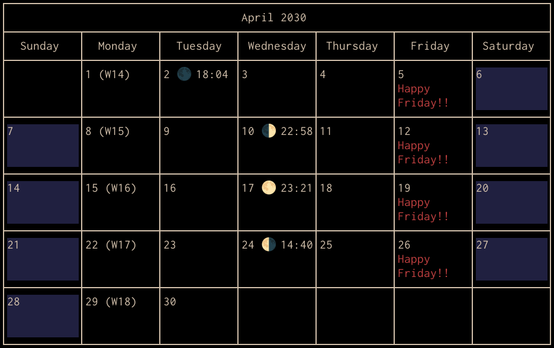
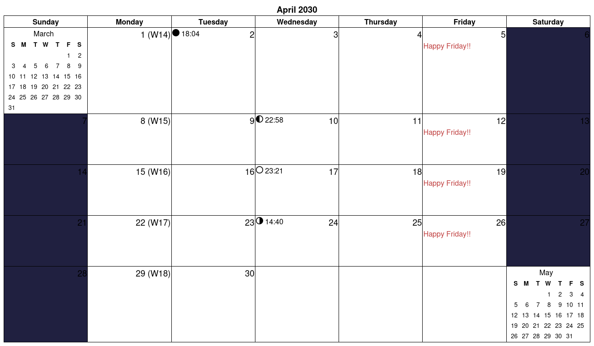

# Chapter 12: Producing Calendars

We’ve already discussed Calendar Mode in Section 2.2 on page 9. This chapter delves more deeply into Calendar Mode and also describes helper programs that let you produce PDF or HTML calendars.

## 12.1 Calendars in the Terminal

We’ve seen that you can produce a calendar in your terminal by running one of the following commands:

    $ remind -c filename [date]
    $ remind -cu filename [date]

The first command uses ASCII characters `+`, `-` and `|` to draw the calendar boxes, whereas the second uses Unicode box-drawing characters.

The full syntax of the `-c` command-line option is actually:

- `c[flags][n]`

Note that the square brackets indicate *optional* components and should not be used literally. The optional *flags* are:

- `a` – Causes Remind to display reminders on the days they actually trigger *as well as* any preceding days specified by the reminder’s delta.
- `u` – Use Unicode line-drawing characters to draw the calendar boxes.
- `+` – Generate a weekly calendar instead of a monthly one.

The last part of the option, *n*, is a positive decimal number. It instructs Remind to produce *n* months’ (or weeks’) worth of calendars.

So, for example, to produce 4 weeks’ worth of calendars using Unicode line-drawing characters:

    $ remind -cu+4 filename

#### 12.1.1 If Your Terminal Calendar Displays are Messed Up

If you run `remind -c` and the columns are all out of alignment and funny characters appear, it is likely that your terminal emulator does not support Unicode *left-to-right marks*. In a UTF-8 environment, Remind emits these characters (that should be invisible) to ensure that the calendar printing direction is correct for column alignment, even if your reminders contain some right-to-left text.

If your terminal does not properly support left-to-right marks, you can suppress them by setting this system variable at the top of your Remind script:

    SET $SuppressLRM 1

Alternatively, you can invoke Remind as follows:

    $ remind -c '-i$SuppressLRM=1' filename [date]

## 12.2 Additional Calendar-Related Command-Line Options

#### 12.2.1 First Day of the Week

Remind normally generates a calendar with Sunday in the leftmost column and Saturday in the rightmost column. Some countries standardize having Monday at the left and Sunday at the right; the `-m` command- line option makes Monday the first day of the week:

    $ remind -cu -m filename

#### 12.2.2 Size of the Calendar

Normally, if standard output is connected to a terminal, Remind adjusts the width of the calendar to approximately fill the terminal. The `-w` option lets you control the width of the calendar as well as some other dimensions. The full syntax of the `-w` option is:

- `wcol[,pad[,spc[,spc2]]]`

(Again, the square brackets denote optional arguments. The commas, however are literal.)

In the above syntax, *col* is a number specifying the width of the calendar in columns. Alternatively, it can be specified as the letter `t` which causes Remind to compute the width according to the size of `/dev/tty`.

*pad* specifies how many lines to use to pad empty calendar boxes, and it defaults to 5. If the calendar is too big to fit comfortably on the terminal, you can use a smaller *pad*.

*spc* specifies how many blank lines to leave between the day number and the first reminder entry. It defaults to 1; you can set it to 0 to make the calendar more compact.

*spc2* can be specified either as 1 (the default) or 0. If specified as 0, then no blank lines are left between reminders in a given calendar box. If specified as 1, then one blank line is left between such reminders.

Any of *col*, *pad*, *spc* or *spc2* can be omitted. Here are some examples:

    # Use the default number of columns and padding, but
    # leave no blank lines between the day number and the reminder
    $ remind -cu -w,,0 pathname

    # Make the calendar 80 columns wide; keep boxes as small as
    # possible with no blank lines between the day number and the reminder
    # or between reminders themselves.
    $ remind -cu -w80,0,0,0 pathname

#### 12.2.3 Time Format

In Calendar Mode, Remind normally precedes reminders with the time of day. The `-b` option controls how times are formatted:

- `-b0` causes times to be displayed in 12-hour (AM/PM) format, and is the default.
- `-b1` causes times to be displayed in 24-hour format (`00:00` to `23:59`.)
- `-b2` suppresses the time that normally precedes the body of timed reminders.

## 12.3 Machine-Readable Calendar Output

Remind’s `-p` option produces machine-readable output that helper programs can use to generate calendars. The `-p` options has three variants:

- `-p` produces machine-readable output, but in an ad-hoc format. This format is relatively inflexible, but is the oldest format.
- `-pp` produces a slightly more flexible format using JSON to represent calendar entries.
- `-ppp` produces pure JSON output and is the most flexible format.

All of the `-p`, `-pp` and `-ppp` formats are described in the **rem2ps**(1) man page.

Any of the `-p...` options may be followed by a plus sign, `+`, in which case data for a weekly calendar is output rather than a monthly calendar. The `+` sign also automatically forces the output format to pure JSON (the same as `-ppp`).

Finally, the option may be followed by a number *n* (with no intervening whitespace.) This produces calendar data for *n* months (or weeks if `+` was used.)

## 12.4 PDF Calendars

Remind can’t create PDF calendars directly, but a helper program called `rem2pdf` can take the output of `remind -ppp` and convert it into a PDF calendar.

You can create a PDF calendar for January 2027 something like this:

    $ remind -ppp pathname January 2027 | rem2pdf > jan.pdf

Rem2pdf has *many* command-line options; I will not document them all here. See the **rem2pdf**(1) man page for details, or run `rem2pdf --help` for a synopsis. However, below are some of the more frequently-used command-line options:

- `-l` or `--landscape` – generate a calendar in landscape orientation rather than the default portrait orientation.

- `-e` or `--fill-page` – make the monthly calendar fill the page. Normally, rem2ps makes each row slightly smaller than necessary to fill the page, in case one row contains a lot of reminders. This option makes all the rows the same size.

- `-c``n` or `--small-calendars=``n` – controls the placement of the small previous-month and next- month calendars. The value of *n* can range from 0 to 3, with the following meanings:

  **0** – do not draw any small calendars. This is the default.

  **1** – Place the small calendars together at the bottom right if there is room; otherwise, place them at the top left.

  **2** – Place the small calendars together at the top left if there is room; otherwise, place them at the bottom right.

  **3** – Place the previous month’s calendar at the top left and the next month’s at the bottom right if there is room. Otherwise, use the same rules as *n*=1.

- `-y` or `--wrap` – make a monthly calendar fit in at most 5 rows by “wrapping around” the day boxes for the 30th and 31st to the top left if there’s not enough room on the bottom right.

- `-x` or `--left-numbers` – put day numbers in the top left corner of each day’s calendar box rather than the default top right.

- `-p``n` or `--weeks-per-page=``n` – if generating weekly calendars, put *n* weeks’worth of data on each page, where *n* can range from 1 to 4.

Here are some examples of generating PDF calendars:

    # Generate a landscape calendar for January 2027, filling the page
    $ remind -ppp ~/.reminders 2027-01-01 | rem2pdf -e -l > /tmp/cal.pdf

    # Same as previous example, but with small calendars, day numbers
    # on the left, and occupying at most 5 rows
    $ remind -ppp ~/.reminders 2027-01-01 | \
      rem2pdf -e -l -c3 -x -y > /tmp/cal.pdf

    # A 12-month calendar for 2028 with the first column being Monday
    # Note that the -m option is for remind, not rem2pdf.  Remind
    # communicates to back-end programs that they should start the week
    # on Monday.
    $ remind -m -ppp12 ~/.reminders 2028-01-01 | \
      rem2pdf -e -l -c3 -x -y > /tmp/cal.pdf

    # A calendar for the next 8 weeks, with 4 weeks per page
    $ remind -p+8 ~/.reminders | rem2pdf -l -p4 > /tmp/cal.pdf

#### 12.4.1 Generating PostScript and SVG Instead of PDF

Although the program is called `rem2pdf`, it can actually generate calendars in other formats:

- `remind options pathname | rem2pdf --ps` will generate PostScript output.
- `remind options pathname | rem2pdf --svg` will generate SVG output.
- `remind options pathname | rem2pdf --eps` will generate encapsulated PostScript output.

Note that for EPS and SVG output, `rem2pdf` will convert only the *first* page of output and will issue a warning if you try to generate a multi-page file. EPS and SVG don’t directly support multi-page files.

## 12.5 HTML Calendars

A program called `rem2html` converts the output of `remind -ppp ...` to HTML, just as `rem2pdf` converts it to PDF.

`Rem2html` accepts a number of command-line options; the most commonly-used ones are:

- `--utf8` – Assume that Remind produces UTF-8 output and write UTF-8-encoded HTML.
- `--stylesheet url.css` – Supply the URL for a CSS stylesheet. If this option is not given, then a default inline stylesheet is used.
- `--nostyle` – Do not use CSS at all to style the output; produce a very basic HTML-only calendar.
- `--tableonly` – Instead of producing a complete HTML document, produce only a `<table>...</table>` block suitable for including into a larger HTML file.

For documentation on the other command-line options, see the **rem2html**(1) man page.

Here are some examples of generating HTML calendars:

    # Generate calendar for January 2027
    $ remind -ppp ~/.reminders 2027-01-01 | rem2html > /tmp/cal.html

    # A calendar for the next 8 weeks, with Monday leftmost.
    $ remind -p+8 -m ~/.reminders | rem2html > /tmp/cal.html

## 12.6 Restricting Reminders to Calendar Mode or Agenda Mode

Sometimes, you might want a reminder that appears only in Calendar Mode and not in Agenda Mode. Conversely, you might want one in Agenda Mode but not Calendar Mode.

To make a reminder appear in Calendar Mode but not Agenda Mode, simply use the `CAL` keyword instead of `MSG` in the `REM` command:

    REM Wednesday CAL Only in Calendar Mode!

To make a reminder appear in Agenda Mode but not Calendar Mode, use the `MSG` keyword as normal, but use a pair of `%"%"` substitution filter sequences next to one another to make the part that would normally appear in the calendar empty:

    REM Wednesday MSG %"%"Only in Agenda Mode!

## 12.7 Special Data for Calendars

Remind has a facility for passing special types of data to back-end calendar-producing programs. This data can be used for various purposes:

1.  To shade a calendar box a certain color.
2.  To display a moon-phase icon.
3.  To annotate the calendar box with the week number.
4.  To display colored reminders.

The way you pass this information to the back-end is with a `SPECIAL` reminder, which looks like this:

    REM trigger... SPECIAL type body

The *trigger* is any normal Remind trigger specification. The *type* specifies the type of special data to send to the back-end, and the *body* is the body of data to send.

Remind does not care what *type* or *body* you supply; it will happily send whatever you put there. Back- ends can define what types of data they accept and the syntax that the body should follow. Any back-end *must* ignore a `SPECIAL` that it doesn’t understand.

`SPECIAL` reminders are ignored in Agenda Mode (with one exception as discussed in Section 12.7.4 on page 93); they are triggered only in Calendar Mode.

All of the back-ends that ship with Remind respect four standard types of special data: `SHADE`, `MOON`, `WEEK` and `COLOR`. These will be described in the following sections.

#### 12.7.1 SHADE

The `SHADE` special reminder has a body that consists either of a single integer from 0 to 255, or three space-separated integers from 0 to 255.

If the `SHADE` keyword is followed by a single number, then the calendar cell where it triggers is shaded grey, where 0 is completely black and 255 is completely white. If it is followed by three numbers, then they are interpreted as red, green and blue values from 0 to 255, respectively.

Here is a concrete example. Suppose you want to shade a calendar box light green if it is somebody’s birthday, and all your birthday reminders are in a file called `birthdays.rem`. You could use this:

    # The system variable $NumTrig contains the number of REM
    # commands that have been triggered so far.  Here we save
    # the current value
    SET n $NumTrig

    DO birthdays.rem

    # If anything triggered, shade the calendar box
    IF $NumTrig > n
        REM SPECIAL SHADE 224 255 224
    ENDIF

For example, if Jane’s birthday is on February 11, then `rem2pdf` might produce something like Figure 12.1

*Figure: calendar rendering — see page 104 of the PDF*

*Figure 12.1: A Calendar with a Shaded Box*

#### 12.7.2 MOON

The `MOON` special reminder looks like this:

    REM trigger SPECIAL MOON phase moonsize fontsize msg

In the body of the `MOON` special reminder, the parts have the following meanings:

- *phase* is an integer from 0 to 3, where 0 represents a new moon, 1 the first quarter, 2 a full moon, and 3 the last quarter.
- *moonsize* is the diameter in 1/72 of an inch of the moon icon. If omitted or supplied as -1, the back- end will pick an appropriate size. Note that *moonsize* is merely a suggestion and some back-ends ignore it.
- *fontsize* is the height in 1/72 of an inch of the font used to draw the message *msg*. If omitted or supplied as -1, the back-end will pick an appropriate size. Note that *fontsize* is merely a suggestion and some back-ends ignore it.
- *msg* is additional text that is placed near the moon glyph.

For example, if I take the following Remind script:

    REM [moondate(0)] SPECIAL MOON 0 -1 -1 [moontime(0)]
    REM [moondate(1)] SPECIAL MOON 1 -1 -1 [moontime(1)]
    REM [moondate(2)] SPECIAL MOON 2 -1 -1 [moontime(2)]
    REM [moondate(3)] SPECIAL MOON 3 -1 -1 [moontime(3)]

And I run the following command with my location and time zone set to Ottawa, Ontario, Canada:

    $ remind -ppp moon.rem 2027-06-01 | rem2pdf -l > out.pdf

Then the result looks like Figure 12.2

*Figure: calendar rendering — see page 105 of the PDF*

*Figure 12.2: A Calendar with Moon Phase Icons*

#### 12.7.3 WEEK

The `WEEK` special looks like this:

    REM trigger SPECIAL WEEK text

The *text* can be anything you like and it is used to annotate the calendar cell in which it appears. For example, if you want every Monday annotated with the week number, you could use this:

    REM Monday SPECIAL WEEK (W[weekno()])

which annotates every Monday with the text `(W``n``)` where *n* is the week number.

#### 12.7.4 COLOR

1 The `COLOR` special lets you create colored reminders. `COLOR` is *extra-special* in that `COLOR` reminders are treated like `MSG` reminders in that they are *also* issued in Agenda Mode.

A `COLOR` special reminder looks like this:

> 1 `COLOR` can also be spelled `COLOUR`; the two are treated identically

    REM trigger SPECIAL COLOR R G B text

The *R*, *G* and *B* components are integers ranging from 0 to 255, representing the intensity of the red, green and blue components, respectively, of a color. The text *text* is rendered in the given color.

Consider this reminder script:

    REM 31 October SPECIAL COLOR 128 82 0 Happy Halloween!!

Producing a PDF calendar by running:

    $ remind -ppp halloween.rem 1 oct 2030 | rem2pdf -l > halloween.pdf

will yield the calendar shown in Figure 12.3.

*Figure: calendar rendering — see page 106 of the PDF*

*Figure 12.3: A Colored Reminder*

**Colored Reminders and Shading in the Terminal**

By default, Remind does *not* attempt to color reminders or shade calendar cells in the terminal (that is, if you run Remind with the `-c` option.)

However, you can tell Remind to color reminders (assuming your terminal supports the necessary escape sequences) with the `-@` option. This option works in both Agenda Mode and Calendar Mode, and looks like this:

- `@[n][,m][,b]`

The optional parameters *n*, *m* and *b* can take the following values. (You can omit any or all of the parameters; as long as you have the right number of commas, Remind will know if you’ve omitted a parameter that precedes a non-omitted parameter.)

- *n* can be 0, 1 or 2, with the default being 0. A value of 0 means Remind approximates colors with a very coarse 16-color palette supported by the original VT100 terminal. A value of 1 make Remind approximate the colors with a larger 256-color palettes supported by many terminals. And a value of 2 makes Remind use true 24-bit color escape sequences; this should be supported by most modern terminals.
- *m* can be 0, meaning your terminal background is dark, or 1, meaning it is light. In either case, Remind will adjust the colors in the `REM` command to try to ensure they are readable. A value of 2 means that Remind will not do any color adjustments. Finally, you can use a value of `t` (which is the default). In this case, Remind attempts to obtain the background color of your terminal with a special escape sequence.
- *b* can be 0 (the default) meaning that Remind will ignore `SHADE` specials in the terminal, or 1, meaning it will attempt to shade calendar cells. If you enable shading, then you must use either `-@1` or `-@2` (the 256-color or the 24-bit true color modes.)

Putting everything together, consider this reminder script:

    # Shade weekends blue
    REM Sat Sun SPECIAL SHADE 192 192 255

    # Show moon phases
    REM [moondate(0)] SPECIAL MOON 0 -1 -1 [moontime(0)]
    REM [moondate(1)] SPECIAL MOON 1 -1 -1 [moontime(1)]
    REM [moondate(2)] SPECIAL MOON 2 -1 -1 [moontime(2)]
    REM [moondate(3)] SPECIAL MOON 3 -1 -1 [moontime(3)]

    # Show week number on Mondays
    REM Monday SPECIAL WEEK (W[weekno()])

    # A happy red reminder on Fridays
    REM Friday SPECIAL COLOR 192 64 64 Happy Friday!!

If we generate a calendar in the terminal with the command:

    $ remind -cu -@2,,1 -w90,2,0 everything.rem  1 apr 2030

2 then we get output similar to Figure 12.4 on the next page:

> 2 The moon phase icons only work if your terminal supports UTF-8 and the font it uses has the moon phase icons.

*Figure 12.4: Example of SPECIALs in the Terminal*

On the other hand, if we run that script through `rem2pdf` to produce a PDF calendar like this:

    $ remind -ppp everything.rem  1 apr 2030 | rem2pdf -l > everything.pdf

we get something like Figure 12.5:

*Figure: calendar rendering — see page 108 of the PDF*

*Figure 12.5: Example of SPECIALs rendered as PDF*

And finally, if we run it through `rem2html` like this:

    $ remind -ppp everything.rem 1 apr 2030 | rem2html > everything.html

the result is something like Figure 12.6:

*Figure 12.6: Example of SPECIALs rendered as HTML*

You might notice that the shading in Figures 12.5 on the facing page and 12.6 is a bit off... the weekends are shaded too darkly and the red Friday reminders are a bit too light. That’s because I keep my terminal background dark, so colors that work well on a dark background don’t necessarily work well on a light background.

3 We can fix this by testing the `$PsCal` special variable. This variable is set to 1 if the `-p` command-line option (or its variant) was supplied, or 0 otherwise. So we change the script as follows (changes are highlighted):

    IF $PsCal

       SET blue "224 224 255"
       SET red "64 0 0"
    ELSE

       SET blue "32 32 64"
       SET red "192 64 64"
    ENDIF

    # Shade weekends blue
    REM Sat Sun SPECIAL SHADE  [blue]

    # Show moon phases
    REM [moondate(0)] SPECIAL MOON 0 -1 -1 [moontime(0)]

> 3 `$PsCal` is so named as a relic from the days when the only back-end shipped with Remind produced a PostScript calendar

    REM [moondate(1)] SPECIAL MOON 1 -1 -1 [moontime(1)]
    REM [moondate(2)] SPECIAL MOON 2 -1 -1 [moontime(2)]
    REM [moondate(3)] SPECIAL MOON 3 -1 -1 [moontime(3)]

    # Show week number on Mondays
    REM Monday SPECIAL WEEK (W[weekno()])

    # A happy red reminder on Fridays
    REM Friday SPECIAL COLOR  [red] Happy Friday!!

With this script, the terminal output is unchanged while the PDF output looks a lot more reasonable (Figure 12.7):

*Figure: calendar rendering — see page 110 of the PDF*

*Figure 12.7: Improving the Colors in a PDF Calendar*

#### 12.7.5 Coloring Reminders by Default

Remind has a system variable called `$DefaultColor` that lets you color `MSG`-type reminders by default.

`$DefaultColor` should be set to a STRING taking the form of three space-separated integers ranging from 0 to 255 representing the red, green and blue components of the color. It can also be set to `"-1 -1 -1"` which is a special value that turns off coloring of `MSG`-type reminders (and is the default value.)

Here’s how you might use `$DefaultColor`. Suppose you have work reminders and birthdays in separate files, and you want to color birthdays blue and work reminders red. You could use something like this:

    # Save $DefaultColor
    PUSH-VARS $DefaultColor

    # Birthdays are blue
    SET $DefaultColor "0 0 128"
    DO birthdays.rem

    # Work reminders are red
    SET $DefaultColor "128 0 0"
    DO work.rem

    # Restore old value of $DefaultColor
    POP-VARS

As the example above shows, `PUSH-VARS` and `POP-VARS` work with writable system variables are well as regular variables.

## 12.8 Back-End-Specific SPECIALs

While the `SPECIAL` types discussed earlier are universally supported by all back-ends, there are some back-end-specific `SPECIALs`.

#### 12.8.1 Rem2PDF SPECIAL: PANGO

`rem2pdf` supports a special called `PANGO`. It looks like this:

    REM trigger PANGO body

The *body* is text formatted in the Pango markup language, somewhat similar to HTML markup, described at https://docs.gtk.org/Pango/pango_markup.html.

If the `PANGO` special starts with `@x,y` where *x* and *y* are floating-point numbers, then the marked-up text is positioned absolutely within the calendar box. *x* and *y* are measured in units of 1/72 of an inch.

A positive *x* positions the left edge of the text *x* units to the right of the left side of the calendar box while a negative *x* positions the right edge of the text to the left of the left side of the calendar box.

Similarly, a positive *y* positions the top edge of the text *y* units below the top of the calendar box while a negative *y* positions the bottom edge of the text above the bottom of the calendar box.

Consider the following script *pango.rem*:

    REM 15 Jan SPECIAL PANGO \
          <b>Fancy!</b>
    REM Wed SPECIAL PANGO @1.5,0.5 TL
    REM Wed SPECIAL PANGO @1.5,-3.0 BL
    REM Wed SPECIAL PANGO @-1.5,0.5 TR
    REM Wed SPECIAL PANGO @-1.5,-3.0 BR

If we run this command:

    $ remind -ppp pango.rem 1 Jan 2028 | rem2pdf -l > fancy.pdf

the result looks like Figure 12.8:

*Figure: calendar rendering — see page 112 of the PDF*

*Figure 12.8: The PANGO SPECIAL*

You might have to experiment a bit with absolutely-positioned text to get the *x* and *y* values just right for your use-case. Also note that `rem2pdf` doesn’t take any precautions to prevent absolutely-positioned text from overlapping with day numbers or normal reminders, so use it with care.

#### 12.8.2 Rem2HTML SPECIALs

`rem2html` supports two different `SPECIAL` types:

- `HTML` – Adds an HTML reminder to the calendar. The body is whatever HTML you want to insert in the calendar box.
- `HTMLCLASS` – Adds a CSS class to the calendar cell.

Here are examples of how you might use them:

    REM Wednesday AT 11:00 SPECIAL HTML <b>Very important</b> meeting.
    REM [realtoday()] SPECIAL HTMLCLASS rem-today

The second example adds the CSS class `rem-today` to the calendar box corresponding to the actual system date. The standard CSS that `rem2html` uses defines a `rem-today` class that highlights a calendar cell in red. So the `REM` command has the effect of highlighting today’s date in red.
