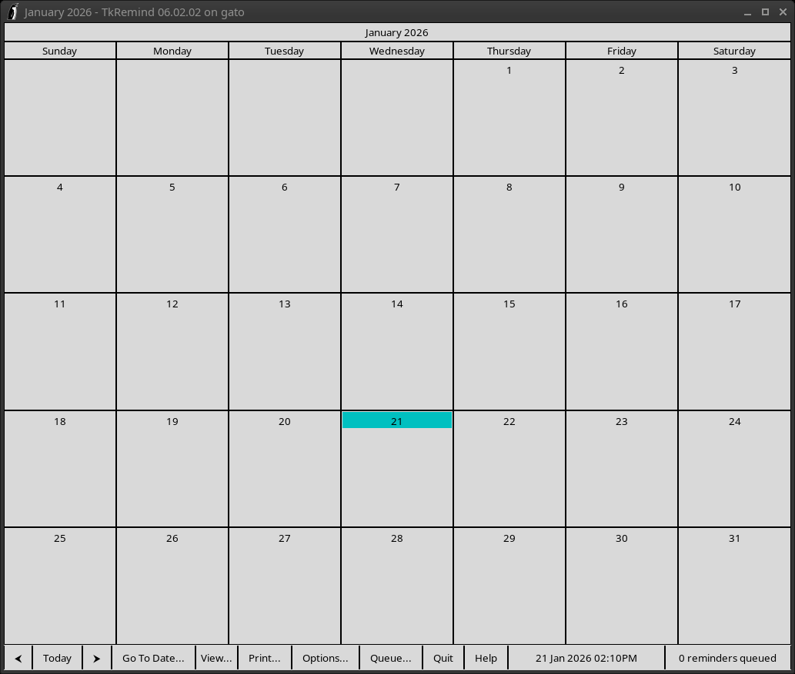
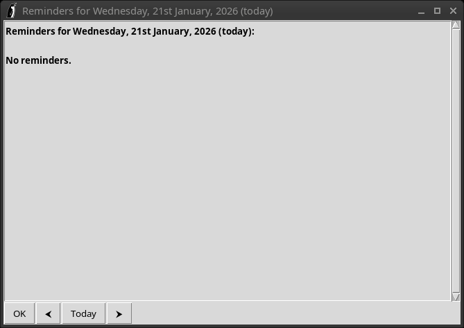
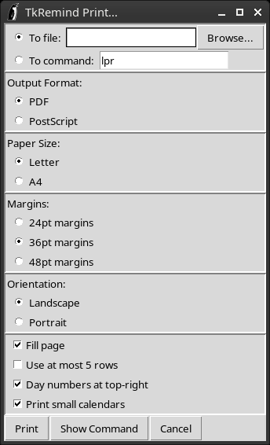
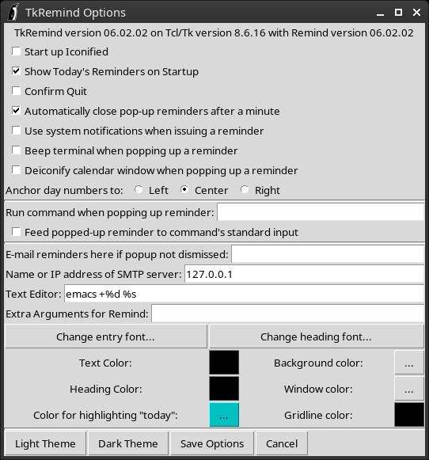
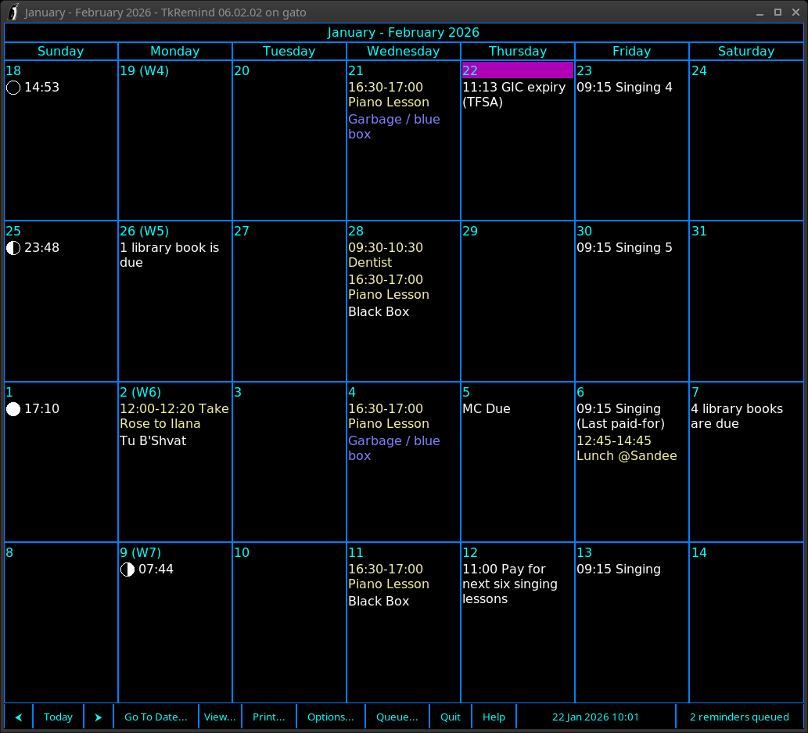
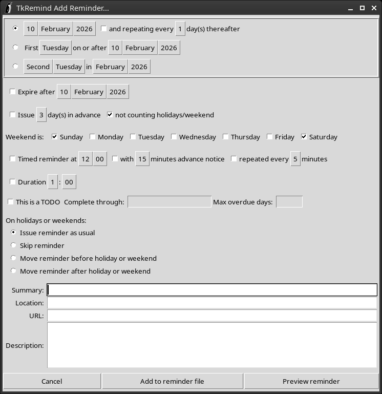

# Chapter 14: The TkRemind Graphical Front-End

Although Remind is a command-line tool and all the examples so far have shown its use on the command- line, Remind also ships with a program called `tkremind`. This is a graphical front-end for Remind; it displays your calendar as a window and it lets you create events graphically.

If you are going to use `tkremind`, I *strongly* recommend that you create a directory called `.reminders` in your home directory and store your reminders in `*.rem` files in that directory. That is the best setup for using `tkremind` and I’ll assume you’ve gone and done that. If you don’t want to do this, see the **tkremind**(1) man page for other ways to run `tkremind`.

To start TkRemind, simply type the following command:

    $ tkremind

The main TkRemind window will appear (Figure 14.1 on the next page):

*Figure 14.1: The Main TkRemind Window*

In addition, another window with today’s reminders in Agenda Mode will pop up (Figure 14.2):

*Figure 14.2: The Agenda Mode Window*

## 14.1 Main Window

The main window displays a calendar. The default view is one month, but this can be changed to display one week, two weeks or four weeks instead via the “View...” menu.

The “ ” and “ ” buttons move the view backwards or forwards, respectively. If the view is set to one month, then the buttons move the view by one month backwards or forwards. If the view is set to any of the weekly views, then the view is moved by *one week* each time the button is pressed.

The “Today” button changes the view to the current month (if the view is set to one month) or positions the current date in the top row of the view if it is set to one of the weekly views.

The “Go To Date...” button pops up a small dialog (Figure 14.3) that lets you enter a month and year. The view is then positioned to that month and year. (In one of the weekly views, the view is positioned such that the first day of the specified month appears in the top row.)

*Figure 14.3: The Go To Date Dialog*

#### 14.1.1 Keyboard Shortcuts

The following keyboard shortcuts are available in the main window:

- **Left Arrow**, **Page Up** – Move the view backwards.
- **Right Arrow**, **Page Down** – Move the view forwards.
- **Home** – Move the view to the current date.
- **m** – Set the view to one month.
- **1** – Set the view to one week.
- **2** – Set the view to two weeks.
- **4** – Set the view to four weeks.
- **h**, **?**, **F1** – Open Help window.
- **g** – Go to a specific date
- **o** – Open the “Options...” dialog.
- **p**, **Control-p** – Open the “Print...” dialog.
- **t** – Open an “Agenda Mode” window with today’s reminders.
- **Control-q** – Quit.

## 14.2 Queued Reminders

In addition to showing a calendar, TkRemind also runs a Remind process in a special mode called *Server Mode*. This handles queued reminders and allows TkRemind to pop up a window whenever a queued reminder is triggered.

For details about Server Mode, please see the **tkremind**(1) man page.

## 14.3 Printing The Calendar

The “Print...” button brings up the Print Dialog (Figure 14.4).

*Figure 14.4: The Print Dialog*

Note that TkRemind will print whatever matches the main window view; if you are viewing a monthly calendar, that’s what will be printed. If you are viewing a 4-week calendar, then a 4-week calendar will be printed.

The Print Dialog has six sections, as follows:

1.  In the top section, choose to print either to a file or to a command. The first option lets you save the generated PDF or PostScript, and the second option lets you send it to a printer.
2.  The Output Format section lets you choose whether to generate PDF or PostScript output.
3.  The Paper Size section lets you select Letter size or A4 size paper.
4.  The Margins section lets you choose how wide the margins are around the calendar.
5.  The Orientation section lets you pick Landscape or Portrait orientation.
6.  The final Options section has the following options:
    - Fill page – if you enable this, then the calendar will fill the page and all rows will be the same height. If you do not enable it, then some rows may be smaller than others, to leave room for calendar boxes with many reminders.
    - Use at most 5 rows – if you enable this, then a monthly calendar that might normally use 6 rows will have the last few days “wrapped around” to the top left so only 5 rows are used.
    - Day numbers at top-right – if you enable this, day numbers will be placed at the top right of each calendar cell. Otherwise, they will be placed at the top left
    - Print small calendars – if you enable this, then small calendars for the previous and next month will be included in a monthly calendar. This option has no effect for weekly calendars.

Once you’ve filled in the Print Dialog, you can click “Print” to print the calendar or “Cancel” to cancel. The “Show Command” option gives you a preview of the command that will be executed to produce the calendar. You can edit the command (to enable command-line options not settable via the GUI, for example) and then run the modified command.

## 14.4 Options

The “Options...” button pops up the Options Dialog (Figure 14.5 on the next page).

*Figure 14.5: The Options Dialog*

#### 14.4.1 Basic Options

- If the “Start up Iconified” option is enabled, then TkRemind will start up in an iconified state rather than showing the main window upon startup.
- If “Show Today’s Reminders on Startup” is enabled, then TkRemind will open up an Agenda Mode window with today’s reminders upon startup. If not, then the Agenda Mode window will not automatically open on startup.
- If “Confirm Quit” is enabled, then if you click “Quit” or press `Control-q`, you will be asked to confirm. If not, then TkRemind will simply immediately quit.
- If “Automatically close pop-up reminders after a minute” is enabled, then TkRemind will automatically close the pop-up reminder windows that it creates for queued reminders, if they are not manually closed.
- If “Use system notifications when issuing a reminder” is enabled, then TkRemind will try to use your desktop environment’s system notification facility when queued reminders are issued. For this to work, you must either be running Tcl/Tk 9.0.0 or later, or you must have the `notify-send` program installed and on your `$PATH`.
- If “Beep terminal when popping up a reminder” is enabled, then TkRemind will attempt to make the computer beep when popping up a reminder. Note that modern computer hardware typically lacks the little speaker needed for the beep, so this option is unlikely to be very useful.
- If “Deiconify calendar window when popping up a reminder” is enabled, then TkRemind will open and show the main window whenever a queued reminder is popped up.
- You can choose the alignment of the day numbers in the calendar boxes with the “Anchor day numbers to:” option.

#### 14.4.2 Running a Command When Popping Up a Queued Reminder

If you enter a command in the “Run command when popping up reminder:” box, then that command will be executed when TkRemind pops up a queued reminder. If, in addition, you enable “Feed popped-up reminder to command’s standard input”, then TkRemind will send the queued reminder to the standard input of the command, in the format:

    time: body

Where *time* is the `AT` time of the reminder, and *body* is the body.

#### 14.4.3 Miscellaneous Options

If you would like a reminder emailed to you if you don’t dismiss the popup reminder, enter the email address in the “E-mail reminders here if popup not dismissed” box. You’ll also need to enter a hostname or IP address of an SMTP server that must accept the email without authentication.

You can enter your favorite text editor command in the “Text Editor:” box. We’ll see later that TkRemind invokes the text editor in response to certain actions. In the command, put `%d` where you want to have a line number and `%s` where the name of the file being edited goes. That way, the text editor is opened on the correct file and positioned to a specific line number.

If your editor is Emacs (which it should be!) a good entry for the text editor is:

    emacs +%d %s

If you use vim, then a good choice is:

    vim +%d %s

For gedit, use:

    gedit +%d %s

The “Extra Arguments for Remind” is a catch-all for any extra command-line options you want to pass when TkRemind invokes Remind. I do not recommend putting anything in this box apart from possibly an `-ivar=value` command to initialize a variable; some command-line options will interfere with the correct operation of TkRemind.

#### 14.4.4 Appearance

The final set of options let you change the font for calendar entries, the font used for day number headings, and various colors. Click on a color swatch to open a color picker. As a convenience, the “Light Theme” button presets all colors to the default set of colors, and “Dark Theme” presets them all to a dark theme.

Press “Save Options” to save the options or “Cancel” to cancel.

Figure 14.6 on the facing page is a screenshot of the TkRemind main window in 4-week view mode using the dark theme, a few font changes, some realistic reminders, and the MOON and WEEK specials.

*Figure 14.6: Example of the Dark Theme*

## 14.5 Adding Reminders

To add a reminder using TkRemind, click on the day number of the calendar box to which the reminder should be added (or any one of the boxes if it is a recurring reminder.) The Add Reminder dialog (Figure 14.7 on the next page) appears:

*Figure 14.7: The Add Reminder Dialog*

#### 14.5.1 Basic Recurrences

The top section of the dialog lets you pick one of three basic types of reminders. Pick the one that is the most appropriate for your situation. The raised buttons pop up menus that let you pick specific choices for the parts of the trigger.

#### 14.5.2 Options

- If you want the reminder to expire after a certain date, enable the “Expire after” checkbox and set the expiry date appropriately.
- If you want advance warning, enable the “Issue ... day(s) in advance” checkbox and set the amount of warning that you want. You can choose whether or not holidays and weekends are counted in the amount of advance warning.
- Set the days that constitute the weekend by checking the appropriate checkboxes to the right of “Weekend is:”. The default of Saturday and Sunday is probably correct.
- If you want to create a timed reminder, enable the “Timed reminder at” checkbox and set the trigger time. You can also enable advance warning with the next two checkboxes.
- If you want your reminder to have a duration, enable the “Duration” checkbox and set the duration appropriately.
- If you are creating a TODO-style reminder, enable the “This is a TODO” checkbox. Optionally fill in the “Complete through:” with a date of the form `YYYY-MM-DD` and optionally set “Max overdue days:” to a positive integer.
- The “On holidays or weekends:” let you pick what happens if a reminder falls on a holiday or weekend. The options correspond to issuing the reminder as usual, using the `SKIP` keyword, the `BEFORE` keyword or the `AFTER` keyword.

#### 14.5.3 The Reminder Body

Fill the body of the reminder into the “Summary:” box. The corresponds to what comes after the `MSG` keyword in the `REM` command.

The “Location:”, “URL:” and “Description” fields are optional, but let you assign a location, a link and a longer description to the reminder. We’ll see in Chapter 15 how this additional information is stored in the `REM` command.

To add the reminder, click “Add to reminder file”. If you are running TkRemind with the default options and have created a `$HOME/.reminders` directory, then the new `REM` command is added to the file `$HOME/.reminders/100-tkremind.rem`.

You can also preview the `REM` command that will be added by clicking “Preview Reminder”.

## 14.6 Editing Reminders

If you add a reminder using the TkRemind graphical reminder dialog (Figure 14.7 on the facing page), then when you hover over the reminder in the main window, it will turn red. Click the left mouse button on the reminder to open the Edit Reminder dialog. This looks exactly like the Add Reminder dialog, except it has an additional option, “Delete Reminder”, that lets you delete the reminder.

You can adjust the dialog to edit the reminder and click “Replace Reminder” to update it.

If there are hand-crafted reminders, you cannot edit them in the TkRemind Edit Reminder dialog. Instead, when you hover over them, they will be underlined. Click the left mouse button to open up a text editor positioned to the relevant `REM` command. You can also use the right mouse button to edit a reminder with a text editor—even a reminder created with TkRemind’s Add Reminder dialog.

**NOTE:** If you use the “Preview Reminder” option in the Add Reminder dialog and then you *change* the `REM` command before saving it, you will *no longer* be able to edit it with TkRemind’s Edit Reminder dialog. Instead, you have to edit it by hand in a text editor.

## 14.7 URLs, Location and Description

If you have associated a URL with a reminder, then middle-clicking over the reminder in the calendar opens the URL in a Web browser. If you’ve associated a location or description with a reminder, then hovering over the reminder pops up a box containing the location and description information.

## 14.8 The Queue

Clicking on “Queue...” opens a dialog showing the reminders that are queued for today. You can left-click on any queued reminder to open its corresponding `REM` command in a text editor.

## 14.9 Errors

If there are errors in your reminder file, then the “Queue...” button will turn red and change to “Errors...” Click on “Errors...” to open up a dialog showing the errors. Click on a specific error message to open a text editor positioned to the offending command.

## 14.10 Automatically Adjusting to Changes

If you are running Remind on a Linux system with the `inotify` facility enabled, then TkRemind monitors the `$HOME/.reminders` directory for changes and automatically refreshes the calendar view (and updates the queued reminders, if necessary) when you update a file in that directory.

## 14.11 Variables Set by TkRemind

When TkRemind invokes Remind, it sets the variable `tkremind` to 1. When it invokes Remind to generate a printed calendar, it sets both `tkremind` and `tkprint` to 1. Therefore, in your Remind script, you can detect that it’s being invoked from TkRemind as follows:

    IF catch(tkremind, 0)
        IF catch(tkprint, 0)
            # Calendar is being printed from TkRemind
        ELSE
            # Calendar is being drawn in TkRemind window
        ENDIF
    ELSE
        # Not in TkRemind
    ENDIF

## 14.12 Getting Help

The “Help” button will pop up a window displaying the **tkremind**(1) man page.
